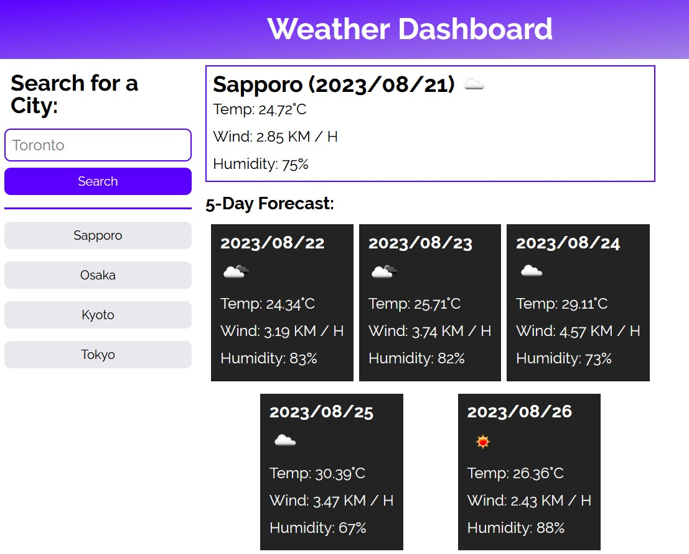

# Module 6 Weekly Challenge - City Weather Dashboard

## Description

Whether you're planning a trip or just planning your day, how you dress and what you bring with you will heavily depend on the expected weather. Thus, this web application allows you to view the upcoming weather forecast of a specific city.

## Usage

View the City Weather Dashboard here;

https://average-kirigiri-enjoyer.github.io/challenge-6-city-weather-dashboard/

There will be four main sections on the page (though on the first visit, one of the won't be visible); the city search UI + search history on the left, and today's weather + five-day forecast on the right.

In the city search UI in the top left, there will be an input box with a search button below. Enter the name of the city you want to view the forecast for, and click search to have that city's weather forecast rendered to the page. Directly to the right, today's weather (icon indicating weather conditions, temperature, wind speed, and humidity) will be displayed in a box. Below, there will be five gray boxes highlighting the expected weather conditions for the next five days.

Upon searching for a city, a reference to it will be added to a search history list just below the city search UI. Clicking on an entry in this list will retrieve the weather data for that city. The search history menu can hold up to twelve entries, and is saved to local storage such that it is preserved when you close the page. If you have made a search entry and reload the page, the most recent search will immediately have the relevant data displayed.

## Preview

## Credits

async await syntax (./assets/scripts/script.js, lines 26, 32, 66, 82, 195, 208); https://stackoverflow.com/questions/50417982/js-fetch-api-access-return-value

.slice() syntax (./assets/scripts/script.js, lines 91, 98, 105, 112, 119);
https://stackoverflow.com/questions/952924/how-do-i-chop-slice-trim-off-last-character-in-string-using-javascript

reset.css file (./assets/css/reset.css);
https://meyerweb.com/eric/tools/css/reset/

## License

Operates under a standard MIT license, refer to the LICENSE file in the repository for more information.
